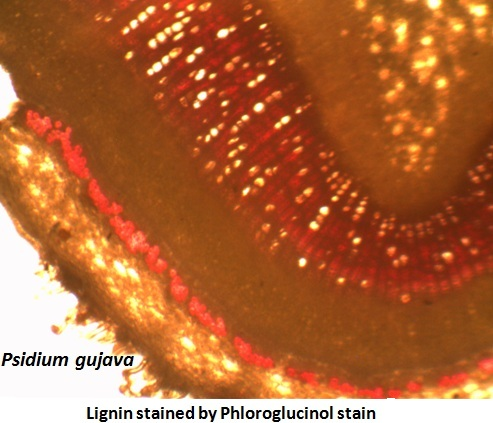
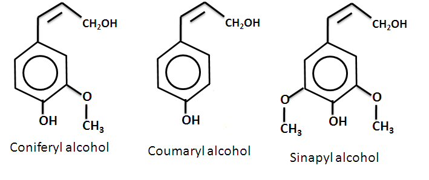
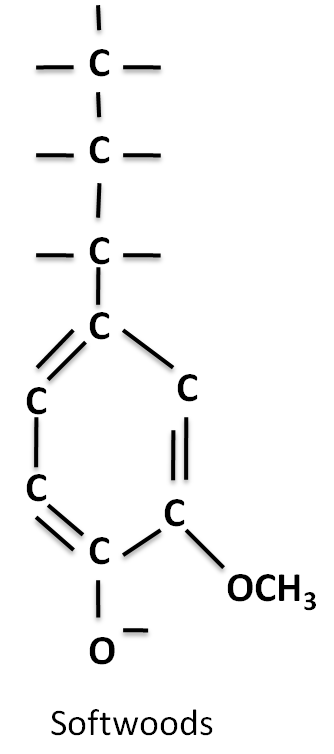
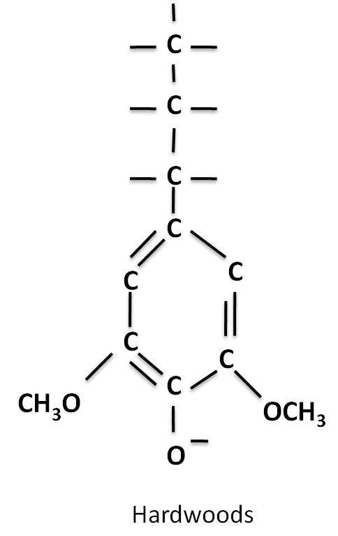
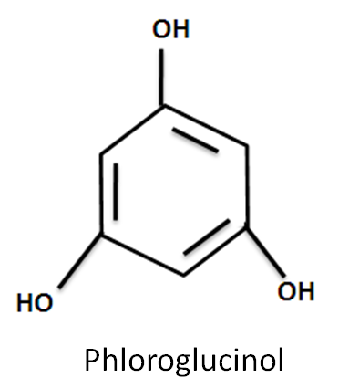

### Principle
 
Lignin is a chemical compound derived from wood and is found in the secondary cell walls of plants. It is a polymer of aromatic subunits derived from phenylalanine. Lignin is found in the spaces in the cell wall between cellulose, hemicelluloses and pectin components. It is covalently linked to hemicelluloses. It is cross linked to different polysaccharides and thus provides mechanical strength to the cell wall and also to the whole plant. Lignin polymers are hydrophobic and hence impermeable to water whereas the polysaccharides are permeable to water.

It constitutes about 30% of dry weight in woody plants and is the most abundant organic compound after cellulose. The lignin content varies considerably even within plants of the same species.

 
&nbsp;
 

#### Chemical composition
 

Lignin is a complex polymer formed by the condensation of precursors like coniferyl alcohol, coumaryl alcohol and sinapyl alcohols. It is made from carbon hydrogen and oxygen. They are classified as phenolics and the polymer is based on the phenylpropane units which is a benzene ring with a tail having  three carbons. It is cross linked to different polysaccharides. Coumaryl alcohol is found in grass and forage type lignins. Coniferyl alcohol is the monomer found in softwoods. Hardwood lignin contains both coniferyl and sinapyl alcohols.

 
&nbsp;

 
&nbsp;

                                                          
   

 

 Lignin is indigestible by animal enzymes but some fungi are able to secrete enzymes which can biodegrade the polymer. It is slowly decomposed in the soil and finally forms  the humus.

 
&nbsp;
 

#### Function
 

Lignin plays a crucial part in transporting water to the plants and is more hydrophobic in nature. The presence of  cross linking of polysaccharides by lignin is one of the  obstacle for water absorption to the cell wall.

It also serves as an important function in plant defence. Due to the complexity and insolubility of lignin it is resistant to degradation by most microorganisms. This resistance to micro organisms will enhance its persistence in the soil. In paper making process, the lignin is removed for the conversion of wood into pulp and paper.

&nbsp;

                                                                                                  

 
&nbsp;                                                                         

#### Phloroglucinol-HCl test for lignin
 

Lignin is a complex constituent in the secondary wall of plant cells; e.g., the walls of xylem elements and sclerenchyma tissue. The cinnamaldehyde end groups of lignin appear to react with phloroglucinol-HCl to give a red-violet colour. Although the reaction is not very sensitive, because of the ease of staining, this procedure is still often used as one of the tests for the presence of lignin in plant cell wall.

